<p align="center">
  
</p>

<h1 align="center">Nova</h1>

<p align="center">
  <em>Your local-first, voice-enabled AI assistant — witty, trilingual, and entirely yours.</em>
</p>

<p align="center">
  
  
  
  
  
</p>

---

## What is Nova?

Nova is a personal AI assistant that runs locally on your machine. Think Jarvis from Iron Man — but she's witty, playful, speaks three languages, and doesn't require a billion-dollar suit.

She uses a local LLM (Qwen 3 14B) through Ollama for reasoning, a modular tool system for real-world actions, and a fully local voice pipeline so you can talk to her naturally. No cloud dependency for core functionality, no subscription fees, complete privacy.

### Key features

- **Local-first** — Brain, voice, and memory all run on your hardware. Your conversations stay yours.
- **Tool-calling architecture** — Nova doesn't just chat. She searches the web, monitors your system, manages todos, and more — with a plugin system that makes adding new capabilities straightforward.
- **Voice interface** — Faster-Whisper for ears, edge-tts for mouth, "Hey Nova" wake word. All running on CPU to preserve VRAM for the LLM.
- **Trilingual** — Speaks English, Dutch, and Russian. Automatically mirrors whatever language you use.
- **Personality** — Not a generic chatbot. Nova has character — sharp wit with casual warmth.
- **Expandable** — Provider abstraction means Claude, OpenAI, or any other LLM can be added as an alternative brain without rewriting the core.

## Hardware requirements

Nova was designed for the following setup, but should work on similar configurations:

| Component | Spec | Purpose |
|-----------|------|---------|
| GPU | NVIDIA RTX 5070 (12 GB VRAM) | LLM inference, STT, TTS |
| RAM | 64 GB DDR5 | Model offloading headroom |
| CPU | AMD Ryzen 7800X3D | Async processing, audio pipeline |
| Storage | SSD recommended | Model weights (~10 GB), memory DB |
| OS | Windows + WSL2 (Ubuntu) | Runtime environment |

**Minimum**: An NVIDIA GPU with 10+ GB VRAM for the 14B model. 8 GB VRAM users can run Qwen 3 8B instead.

## Architecture

```
You (voice / text)
    ↓
┌─────────────────────────────────────────┐
│              Nova Core                  │
│                                         │
│   brain.py ←→ tool_router.py            │
│       ↕            ↕                    │
│   memory.py    [modules]                │
│   (SQLite)     ├── web_search           │
│                ├── system_monitor        │
│                ├── todo_reminders        │
│                └── ... (expandable)      │
│                                         │
│   providers/                            │
│   ├── ollama_provider.py  (default)     │
│   └── claude_provider.py  (future)      │
└─────────────────────────────────────────┘
    ↕
┌─────────────────────────────────────────┐
│           Voice Pipeline                │
│   Faster-Whisper → Nova → edge-tts     │
│   (STT, CPU)       Core   (TTS, CPU)   │
│            "Hey Nova" wake word         │
└─────────────────────────────────────────┘
```

For a detailed visual blueprint, see [`docs/blueprint.svg`](docs/blueprint.svg).

## Getting started

### Prerequisites

1. **WSL2 with Ubuntu** installed on Windows
2. **NVIDIA drivers** working in WSL (`nvidia-smi` should show your GPU)
3. **Python 3.11+** installed in WSL
4. **Ollama** installed in WSL:
   ```bash
   curl -fsSL https://ollama.com/install.sh | sh
   ```

### Installation

```bash
# Clone the repository
git clone https://github.com/YOUR_USERNAME/nova.git
cd nova

# Pull the model
ollama pull qwen3:14b

# Install Python dependencies
pip install -r requirements.txt

# Set up configuration
cp config.example.yaml config.yaml
cp .env.example .env
# Edit .env with your API keys (if any)
```

### Running Nova

```bash
# Make sure Ollama is running
ollama serve

# Start Nova in text mode
python main.py

# Start Nova with voice
python main.py --voice
```

## Project structure

```
nova/
├── main.py                  # Entry point
├── config.yaml              # Settings & module toggles (gitignored)
├── .env                     # Secrets & API keys (gitignored)
├── core/
│   ├── brain.py             # Tool-calling loop, provider dispatch
│   ├── memory.py            # SQLite conversation & fact memory
│   ├── tool_router.py       # Module registration & dispatch
│   └── config_loader.py     # Config validation
├── providers/
│   ├── base.py              # LLMProvider abstract base class
│   ├── ollama_provider.py   # Local Ollama inference
│   └── claude_provider.py   # Anthropic API (future)
├── voice/
│   ├── listener.py          # Faster-Whisper STT + webrtcvad silence detection
│   ├── speaker.py           # edge-tts TTS
│   └── wake_word.py         # Whisper-based "Hey Nova" wake word
├── modules/
│   ├── base.py              # NovaModule base class
│   ├── web_search.py        # DuckDuckGo search
│   ├── system_monitor.py    # CPU/RAM/GPU stats
│   ├── todo_reminders.py    # Persistent todos & scheduled reminders
│   ├── research.py          # Multi-source research, news, Wikipedia, URL summarization
│   └── spotify/             # Spotify playback control (play, queue, lyrics search)
│       ├── __init__.py      # Re-exports all public module classes
│       ├── play.py          # SpotifyPlayModule
│       ├── control.py       # SpotifyControlModule, SpotifySkipToModule
│       ├── now_playing.py   # SpotifyNowPlayingModule
│       ├── queue.py         # SpotifyQueueModule, SpotifyViewQueueModule
│       ├── playlists.py     # SpotifyMyPlaylistsModule
│       └── lyrics_search.py # SpotifyLyricsSearchModule (Genius API)
├── data/
│   └── memory.db            # SQLite database (gitignored)
├── docs/
│   └── blueprint.svg        # Architecture diagram
└── tests/
    ├── test_brain.py
    ├── test_memory.py
    └── test_modules/
```

## Modules

Nova's capabilities are modular. Each module is a self-contained tool that the LLM can invoke through the tool-calling loop.

### Available

| Module | Description | External deps |
|--------|-------------|---------------|
| **Web search** | Search the internet via DuckDuckGo | `ddgs` (no API key) |
| **System monitor** | CPU, RAM, GPU usage and disk info | `psutil`, `GPUtil` |
| **Todo / reminders** | Create, list, complete todos with scheduled reminders | SQLite (built-in) |
| **Research** | Multi-source search, news headlines, Wikipedia lookups, URL summarization | `httpx`, `feedparser` |
| **Spotify** | Play music, control playback, skip to track, view queue, manage playlists | `spotipy`, Spotify API key |
| **Spotify lyrics search** | Identify a song from a lyric snippet and confirm before playing | `httpx`, Genius API key |

### Roadmap

| Phase | Module | Status |
|-------|--------|--------|
| 3 | News & research | Complete |
| 4 | Spotify integration | Complete |
| 5 | Spotify lyrics search (Genius API) | Complete |
| 6 | Google Calendar | Planned |
| 7 | Memory upgrade (semantic search, ChromaDB) | Planned |
| 8 | Provider abstraction (Claude / OpenAI fallback) | Planned |

### Creating a new module

Every module inherits from `NovaModule` and implements a simple interface:

```python
from modules.base import NovaModule

class MyModule(NovaModule):
    name = "my_module"
    description = "What this tool does — shown to the LLM"
    parameters = {
        "type": "object",
        "properties": {
            "query": {"type": "string", "description": "The search query"}
        },
        "required": ["query"]
    }

    async def run(self, **kwargs) -> str:
        query = kwargs["query"]
        # Do the thing
        return f"Result for: {query}"
```

Register it in `core/tool_router.py` and Nova can use it immediately.

## Configuration

Nova uses a split config strategy:

| File | Contains | Committed to git? |
|------|----------|--------------------|
| `config.yaml` | Model settings, module toggles, voice config, behavior | No (template provided) |
| `config.example.yaml` | Template with placeholder values | Yes |
| `.env` | API keys, tokens, secrets | No |
| `.env.example` | Template showing required env vars | Yes |

## Memory system

**Current (MVP):** Conversation history stored in SQLite. Messages persist across sessions with automatic context window management.

**Planned:**
- Session summaries — compressed recaps of past conversations
- Fact extraction — auto-detected and manually stored long-term knowledge
- Vector search — semantic memory retrieval via ChromaDB

## Voice pipeline

All voice processing runs locally on GPU:

| Component | Technology | Purpose |
|-----------|-----------|---------|
| STT | Faster-Whisper (`base`, CPU) | Speech recognition, EN/NL/RU auto-detect |
| TTS | edge-tts (Microsoft neural voices) | Natural speech synthesis, no API key |
| Wake word | Whisper `tiny` (CPU, fully offline) | "Hey Nova" / "Nova" activation |
| VAD | webrtcvad (aggressiveness=3) | Silence detection — only real speech resets the timer |

**VRAM:** All voice models run on CPU — the full 12 GB stays free for the LLM.

## Development

```bash
# Run all tests
python -m pytest tests/

# Run specific module tests
python -m pytest tests/ -k "test_web_search"

# Test the model directly
ollama run qwen3:14b
```

### Contributing

This is a personal project, but if you're building something similar and want to share ideas, feel free to open an issue.

### Git conventions

- Branches: `feature/module-name` or `fix/description`
- Commits: imperative mood — "Add Spotify module" not "Added Spotify module"
- Never commit: `config.yaml`, `.env`, `data/memory.db`

## License

TBD

---

<p align="center">
  <em>"At your service — but make it fun."</em> — Nova
</p>
